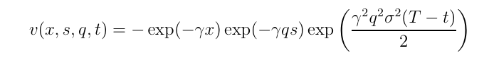

- Two most often source of risk the market maker (MM) faces are:
  - Inventory risk arises from uncertainty in the asset's value
  - Asymetric information risk arise from informed traders (insider info) 
- Common MM flow: 
  - Calculate "true" price for an asset
  - Derive optimal bid, ask quotes around this price
- We need to model the arrival rate of buy and sell orders that will reach our agent (later)
- The mid price of the stock
- dS_u = sigma*dW_u <=> change in price = volatility * random motion(noise)
- Value function

- 