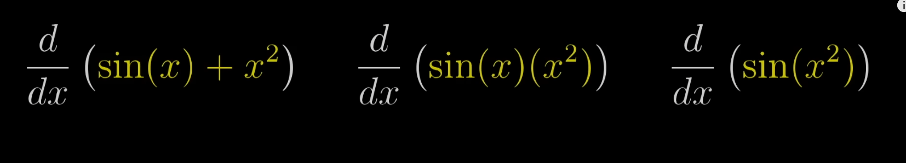

- Three basic ways to combine functions: add, multiply, throw one inside another
- 
- Sum rule: d(f(x) + g(x)) = df(x) + dg(x)
- Product rule: d(f(x)*g(x)) = f(x)*g(x)' + f(x)'*g(x)
- Chain rule: dg(h(x))/dx = dg/dh*dh/dx