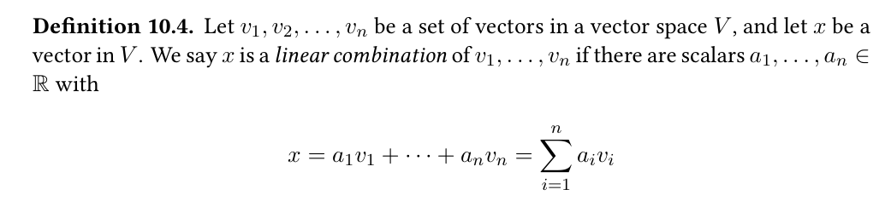
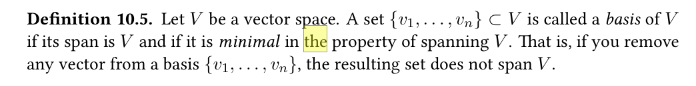
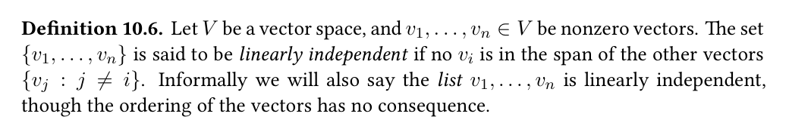
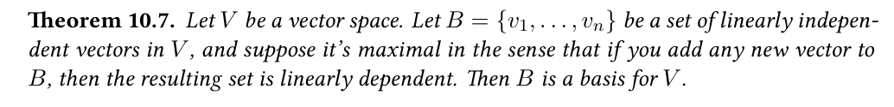

- A function f: A -> B is called linear if the following identity is always true, no matter what x, y, in A are:
f(x+y) = f(x) + f(y) (we need scala multiples too, will comeback later)
- '+' is not just scala addition, it can be vector, maxtrix addition...
- The basis: minimal set of vectors B from which you can get all vectors in V by adding and scaling vectors in B
- B is finite
- for V = R^2, B = {(1, 0), (0, 1)} (note: they are not the only basis, Almost any two vectors you can think of form a basis)
- basis can be thought of as an alternative coordinate system for a vector space

- Span of a set B of vectors: set of all linear combinations of those vectors
0 span(v1,..., vk) = {a1v1 + ... + akvk: ai in R}

