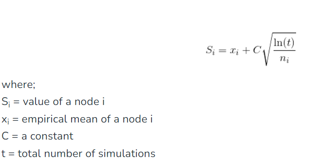
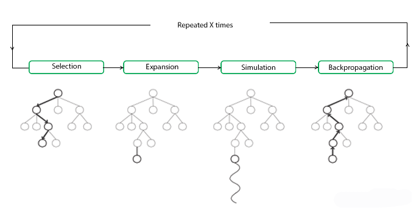

# Definition
- sampling and exploring only promising areas of the hunt area
- build a search tree incrementally by simulations (rollouts)
- when a simulation end -> we reach a leaf node, the results are propagated back to the previous nodes
- update the visit time and win ratios of visited nodes in simulation
- select moves by considering both exploitation of promising movements with high win ratios 
and exploration of unexplored or less explred moves
- auto balance exploration and exploitation using upper confidence bounds for tree (UCT)
- selection phase: during this process, the child node that returns the greatest value from this equation is picked

- expansion phase: if child node is a leaf node, a new child node is added to the tree to that node
- simulation phase: a simulation is performed by choosing moves or actions until a result is achieved
- backpropagation phase: after having value of the new node, the remaining tree must be updated. Number of
visited is increased, and if result is a win, number of wins is also increased

# Presudo codes
- init tree with root node
- while node is still expandable,
  - node = uct(node)
- pick node.children or node
- result = rollout(node)
- backpropagate(node, result)

# Pros and Cons

## Pros

- can handle complex scenarios with large search spaces, dynamics, strategic decision-making
- suitable for games or scenarios with unknown or imperfect information
- relies on statistical sampling and does not require complete knowledge of the game state
- effectively balances exploration and exploitation during the search process
- inherently scalable and can be parallelized efficiently
- applicable to other problem domains other than games
- domain-independent

## Cons

- tree grows rapidly, requires huge amount of memory
- nodes might not be visited enough number of times to understand its result or outcome in the long run
- needs a huge number of iterations to be able to effectively decide the most efficient path
- high variance
- overfitting