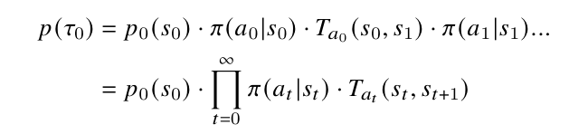
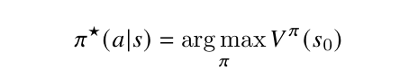
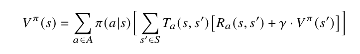
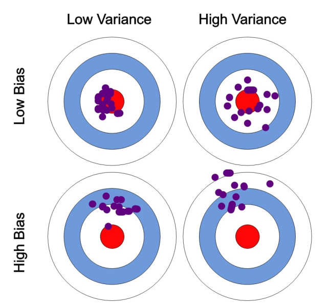

- RL is used to solve sequential decision problems - agent has to make a sequence of decision in order to solve a problem
- The solver is called the agent, the problem is called environment (world), agent seeks to maximize rewards

- The goal is to find the optimal policy function u* that determine the best action to take at state s_t
- We find u* by trying different actions and accumulate the rewards
- Reward is similar to label in supervised learning 
- Markov Decision Process: a 5-tuple (S, A, T_a, R_a, y)
    - S: finite set of legal states, init as s_0
    - A: finite set of actions, A_s is the available set of actions in state s
    - T_a(s, s') = Pr(s_t+1 = s' | s_t = s, a_t = a): probability that action a in state s at time t will transition to state s' at time t+1
    - R_a(s, s'): reward received after action a
    - y in [0, 1]: the discount factor representing the diff between future and present rewards
- For trading: RL's action wouldn't be able to affect the environment (could affect it's own states)
- If we model the problem incorrectly, agent may assume that it's action (buy/sell) affect the prices
- It's like an half-stochastic environment: agent's actions lead to some deterministic states and stochastic states
- Irreversible environment action: There is no undo operator for the environment, if we do, there must be some penalty
- Action space can be discrete or continuous
- In model-free RL the transition function is implicit to the environment and in model-based RL, agent has it's own transition function, an approximation of the env T, learned from feedback
- Rewards are asociated with single states. However, we are most often interested in the quality of a full decision making sequence from root to leaves. The reward for a full sequence is called "return".
- The expected cumulative discounted future reward of a state is called the value function V_r(s). This is the expected reward of s where actions are chosen according to policy r
- There are two types of tasks: 
    - Continuous time, long running, tasks: y is used to recudes the impact of far away rewards y != 1
    - Episodic tasks - tasks that end, y is irrelevent, y = 1
- Policy u: a conditional probability distribution that for each possible state specifies the probability of each possible action, u: S -> p(A).
- p(A) can be discrete or continuous prob distribution, for a particular prob (desity) from this distrubution we write u(a|s)

- Trace t: a sequence of interactions and state changes: t^n_t = {s_t, a_t, r_t, s_t+1,...a_t+n, r_t+n, s_t+n+1}
- Traces are a single full rollout of a sequence from the sequential decision problem. They are also called trajectory, episode, or sequence
- We will not always get the same trace because policy u and transition dynamic can be stochastic. We'll get distribution over traces

- Return R: sum of future reward of a trace

- State value V: we don't care about the return of just one trace, we interested in the expected cumulative reward that a policy can achieve. We define V(s) as the return we expect to achieve when an agent starts in state s and then follow policy u as:

- State-action value Q(s, a) is condition on both state and action, we estimate the average return we expect to achieve when taking action a in state s follow policy u

- RL objective J: achieve the highest possible average return from the start
 
- We then search for a policy that achieves optimal value function: 

- A potential beneft of state-action values Q over state values V is that state-action values directly tell what every action is worth. This may be useful for action selection, since, for discrete action spaces

- Equivalently, the optimal policy can be obtained directly from the optimal Q function

- Bellman equation: compute reward values at the real leaves, using the transition function T_a then compute the value of parent node from the chilren's rewards

- A simple DP method to calculate Bellman's equation is Value iteration:
    - Initialize V(s) to random values
    - Repeatedly updates Q(s, a) and V(s) until convergence
    - Convergence is when values of V(s) stop changing much
    - Works with finite set of actions
    - Guarantee to converge but not very efficient 

- Normally, we'll in a situation when the transition prob are not known to the agent -> model-free method
- Moter Carlo sampling: 
  - Generate a random episode e, loop until we are done or we reach episode length
  - Use the return g from e to update value function at the visited states
- Temporal difference learning (TD): 
  - The process of subsequent refinement by which old estimates of a value are refined with new updates
  - The difference in values between two time steps
  - Update V(s) (the bootstrap-value) with an error value (new minus current) based on the estimate of the next state

- Bias-Variance trade-off: 
  - Monte Carlo does not use bootstrapping, it performs full episode with random action choices before it uses the reward ->
  its actions are unbiased, not influenced by previous reward
  - But it cause high variance of returns between episodes
  - TD bootstraps the Q-function with the values of the previous steps, it learns at each step -> learn more quickly
  - This cause old reward values linger around for a long time, biasing the function value -> low variance

- This makes us think about a middle ground approach: sample a few n steps (not full episode, n > 1) before using the reward value
- The goal of RL is to construct the policy with the highest cumulative reward -> find the best action a in each state s
- Everything is relied on the value function so we call all methods above: value-based method
- Exploration-exploitation trade-off:
  - If we keep choosing the highest Q-value, the model learn nothing, it'll just repeat the same action
- Epsilon-greedy exploration: agent has x% to takes a random action (normally 10%-30%)
- Off-Policy learning: 
  - On-policy: agent select action to perform -> get reward from the env -> learning from its most recent action
  - Learning takes place by using the value of the action that was selected by the POLICY
  - Off-policy: learning from all available information
  - Learning takes place by backing up values of another action, not necessarily the one selected by the behavior policy
  - Make sense when the agent explore, it usually select non-optimal actions during this time
  - The only diff between on and off-policy is how they act when exploring the non-greedy action
- Sparse and dense reward:
  - Dense reward: r exists in every state s
  - Sparse reward: exists only in some states