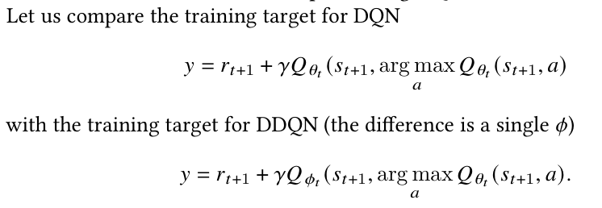

- Deep supervised learning uses a static dataset to approximate a function
- Bootstrapping is also a kind of minimization process in which an error (or diference) is minimized
- Q-learning bootstrapping process lack static ground truth -> loss-function targets move
- We must sample all states to ensure Q-learning converge
- In deep learning the samples can be choosen randomly, in RL the next state will be correlated to the previous state -> training can be stuck in local minima -> need exploration
- Three challenges: 
    - State space is too large to sample fully
    - Strong correlation between subsequent training samples, with a real risk of local optima
    - Loss function of gradient descent literally has a moving target, and bootstrapping may diverge
- Neural networks are designed to individual features of states, these features can be shared by different states -> cause mis-identifcation of states

- Stable deep value-based RL:

- Experience Replay: 
    - When an agent reaches a new level in a game that is diferent from previous levels, the agent may forget how to play the other level
    - Introduces a replay bufer, a cache of previously explored states and being sampled at random
    - By using this bufer, a dynamic dataset from which recent training examples are sampled -> diverse training dataset
    - Improves coverage, and reduces correlation
    - This is a form of off-policy learning
    - Larger networks resulted in more instabilities, but also that longer multi-step returns yielded fewer unrealistically high reward values

- Infrequent Updates of Target Weights:
    - Every N updates, the network Q is cloned to obtain target network Q^ used to generating the tagets
    - The target network change much slower than the behaviour policy, improving stability of Q-targets

- Overestimation:
    - Q-learning may overestimate action values
    - Use Q-network to choose the action but uses separated target Q-target to evaluate the action
    - Updates are assigned randomly to either set of weights
    

- Prioritized Experience Replay:
    - DQN samples uniformly over the entire history in the replay bufer
    - PEX Provides a framework for prioritizing experience. Important actions are replayed more frequently, and therefore learning efciency is improved

- Advantage Function:
    - Using two separate estimators: a value function and an advantage function (AF)
    - AF computes the diference between the value of an action and the value of the state
    

- 