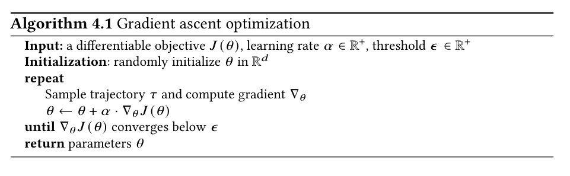
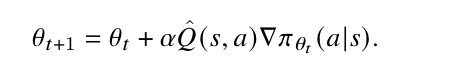

- We can't apply value-based methods for env that have continuous space. For example, a robot arm that can move from 0-180 degree
- We can't run value function V() for every angle, this is impossible -> argmax operation is disabled
- Stochastic environments cause stability problems for value-based methods. Small perturbations in Q-values may lead to 
large changes in the policy of value-based methods
- Policy based method: start with a policy function then improve it by episodes with policy gradient method
- Policy-based methods find suitable continuous or stochastic policies directly without argmax()
- Stochastic policy perform exploration by nature, no need for epsilon greedy -> high variance, local optima, converge slower

# Reinforce

- Start with a parameterized policy function pi_theta
- Sample a trajectory tau
- If it's good, increase the parameters towards tau, otherwise decrease them
- Keep doing this until converge
- To know which policy is best, we need some kind of measure of its quality -> a value J
- It is natural to use the value function of the start state as our measure of quality J(theta) = V(s0)
- We wish to maximize J, if our policy is differentiable, then we can use gradient ascent: 

- Our final goal is to update the parameters theta so that we find the optimal policy
- If action a is better, we want to increase the parameter theta but we don't know which action is the best
- So we take a sample trajectory and estimates the value of the actions
- We use Q(s, a) to do that, Q() can be any function: discounted return, advantage function...

- A problem with this formula is that better action got pushed more frequently, create high bias in our model
- We can correct by dividing by the general probability

# Actor Critic Bootstrapping

- REINFORCE is low bias, high variance since the full episode is sampled
- Actor critic combine the value-based with policy-based approach
- Variance comes from two sources: cumulative reward estimate and gradient estimate
-> bootstrapping for better reward estimates, and baseline subtraction to lower the variance of gradient estimates
- Both methods use a learned value function V(s)