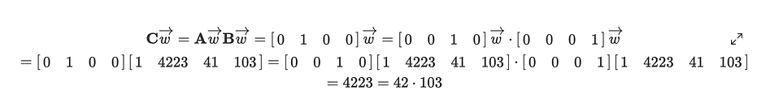
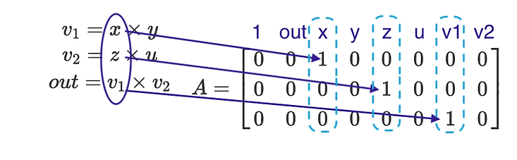
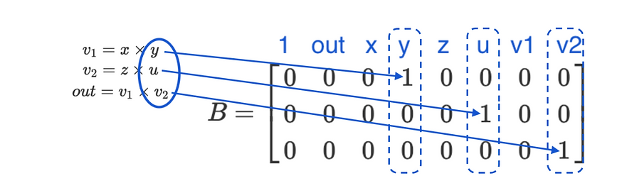
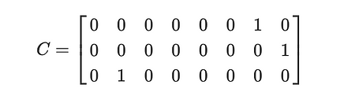
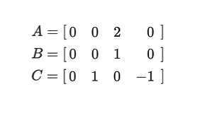

- Witness: is a 1xn vector that contains the values of all input variables, output variable and intermediate values
- By convention, the first element is always 1 to make the calculation easier
- Example: if we have the polynomial: out = x^2y, and we claim that we know the solution then we must know all: x, y and out
    - Rank 1 constraint systems require us to have only 1 multiplication per constraint, so we must rewrite our polynomial as follow:
    - v = x*x
    - out = v*y
    - Our witness is: [1, out, x, y, v]
- Our polynomials and constraints need to be of the form: result = left_hand_side * right_hand_side
- To create a valid R1CS, we need a list of formulas that contains exactly one multiplication
- Our goal is to create a system of equations that has the form: C_w = A_w * B_w (* is matrix multiplication)
- A encodes left_hand_side variables, B encodes right_hand_side variables, and C encodes the result variables. w is the witness vector
- A, B, and C are matrices with the same number of columns as the witness. Each column represents the same variable the witness is using
- The number of rows correspond to the number of constraints
- Example R1CS for equation: out = x * y

- R1CS communicates exactly the same information as a set of polynomial equations, but with a lot of extra zeros
- Example 2: transform : out = x*y*z*u
  - v1 = x*y
  - v2 = z*u
  - out = v1*v2
  - w = [1, out, x, y, z, u, v1, v2]
- There are 3 multiplication and w.shape = 1x8 -> our matrices must have 3 rows, 8 columns
- From the equations, our left hand terms are: x, z, v1 => A[0, 2] = 1, A[1, 4] = 1, A[2, 6] = 1

- Similarly, our right hand terms are: y, u, v2 => B[0, 3] = 1, B[1, 5] = 1, B[3, 7] = 1

- Using the same approach, our result variables are: v1, v2, out => C[0, 6] = 1, C[1, 7] = 1, C[2, 1] = 1

- Addition is free in R1CS: we don't have to create an addition constraint when we have an addition operation
- Instead of writing: out = v1+ 2 we could write: out - 2 = v1
- This is where we use the first column, we'll set it to -2, and dot product is just a sum up of all elements, it automatically
  sum out and -2 => C = [-2, 1, 0, 0]
- Multiplication with a constant: the entries in the matrices is the sane value of the constant variable is multiplied
- For example, out = 2x^2 + y. When we say one multiplication per constraint we mean the multiplication of two variables
- So the optimal solution is: -y + out = 2x*x
- The matrices are defined as follow

- Larger example: out = 3x^2y + 5xy -x -2y + 3
  - v1 = 3xx
  - v2 = v1y
  - out - v2 +x + 2y - 3 = 5xy
  - w = [1, out, x, y, v1, v2]
  - 3 multiplication and w.shape = 1x6 => A, B, C must have 3 rows, 6 columns
  - Left hand terms are: 3x, v1, 5x, => A[0, 2] = 3, A[1, 4] = 1, A[2, 2] = 5
  - Right hand terms are: x, y, y => B[0, 2] = 1, B[1, 3] = 1, B[2, 3] = 1
  - Output variables are: v1, v2, out - v2 + x + 2y => C[0, 4] = 1, C[1, 5] = 1, C[3] = [-3, 1, 1, 2, 0, -1]
- R1CS do not require starting with a single polynomial, suppose we are proving that an array of [x1, x2, x3] is binary. The set polynomial constraints are: 
  - x1 = x1^2
  - x2 = x2^2
  - x3 = x3^2
- Everything is done modulo in R1CS to avoid the burden of dealing with floating point numbers
- In Circom and many other frameworks, math is done modulo 21888242871839275222246405745257275088548364400416034343698204186575808495617
