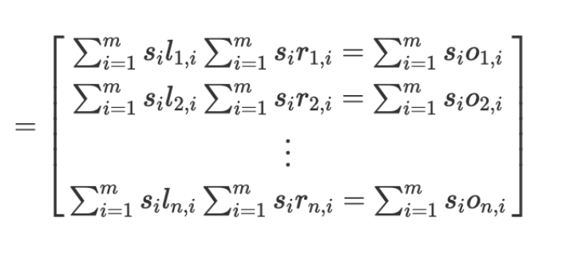
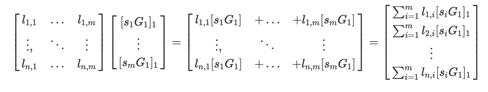
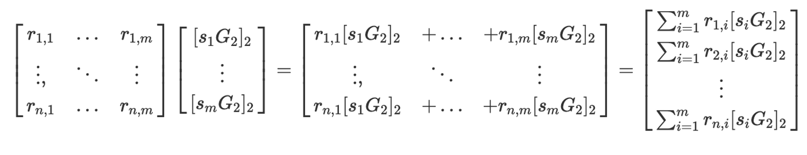
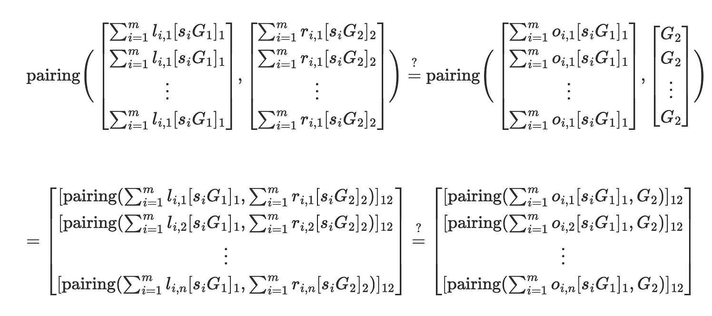

- Given an n quadratic polynomial constraints, with a total of m variables, we encode our R1CS as: Ls * Rs = Os. L, R, O are matrices with n rows and m columns, s is the solution vector (1xm)

- If we encrypt the witness vector by multiplying each entry with G1 or G2, the math still work properly
- Discrete log problem: we say aG1 is a G1 EC point created from multiply a by G1. we cannot extract a given G1 and aG1
- Prover step: we encrypt our s vector by multiplying it by G1. 
  - For matrix L, we got
  
  - For matrix R, We also encrypt s by multiplying it by G2
  
  - After these two operations, we got a column vector of EC points in G1 and a column vector of EC points in G2 and the hadamard product become pairing operatior
  - We could encrypt the s vector by multiplying it by G12 but the points would be too large, so we pair the Os with G1
  and pair each entry with G2. This turns a G1 point into a G12 point
  
