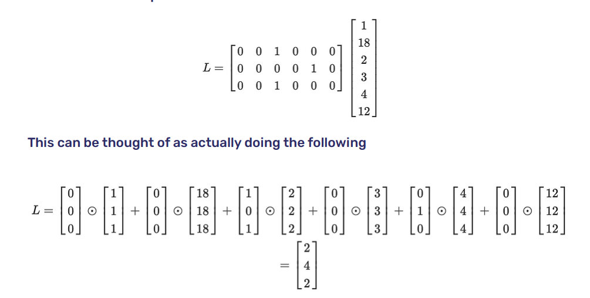
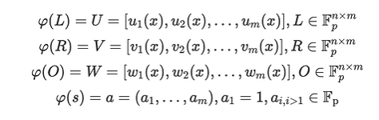
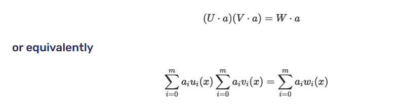
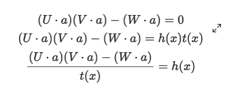

- A QAP is a system of equations where the coefficients are monovariate polynomials and a valid solution results in a single polynomial equality. 
- They are quadratic because they have only one polynomial multiplication
- A program can be represented as an R1CS, but evaluating it is not succinct due to the many operations of matrix multiplication.
- Due to the Schwartz-Zippel Lemma – in a sense, we can compress a polynomial down to a single point
- Key ideas behind QAP:
    - Operations in R1CS form an ring when viewed as a set of vectors
    - Polynomials under addition and multiplication are rings
    - There exists an easily computable homomorphism from R1CS to polynomials
    - Instead of evaluating polynomials by coefficients, we can evaluate them at a random point
- Lets say we have a transformation poly and a random value t. We do the following:
    - u = poly(Ls)(t)
    - v = poly(Rs)(t)
    - w = poly(Os)(t)
- if u*v = w, then the two polynomias are the same, as well as Ls*Rs = Os
- We then turn u, v, w to EC points to hide their value, verifier just need to pairing(A, B) and compare with pairing(C, G12)
- The goal is prove Ls*Rs = Os using only 3 values
- We have:
    - Vectors under addition and hadamard product are rings
    - Polynomials under addition and multiplition are rings
- Theorem: there exists a Ring homomorphism from column vectors of dimension n with real number elements to polynomial
with real coefficients
- Polynomial as a set: instead of thinking of a polynomial as: y = 2x^3 + x^2 -5, we could think of polynomial as a set of infinite pairs (x, y) where (x, y) satisfies the polynomial equation.
- In this definition, we don't have degree or coefficients, just a bag of pairs
- We could add two polynomials as a set using cartesian product
- Computing the transformation function for the homomorphism
  - To make a polynomial convey the same infomation as a vector, we decide on n predetermined values of x whose y values will represent the elements of the vector
  - Theorem: given n points (x, y) on a cartesian plane, they can be uniquely interpolated by a polynomial of degree n-1. If the degree is not constrainted, 
   then there are infinite number of polynomials of degree n-1 or higher can do that
  - If we are encoding n-dimension vectors as polys, we need n predetermined points. Let's say n = 3, we will pick
  x = 1, x = 2, x = 3 (this is arbitrary, we could pick 4, 5, 6...). 
  If we are trying to encode 4, 6, 9 then the polynomial must travel through these points: (1, 4), (2, 6), (3, 9).
- Infinite number of solutions:
  - Our vector has only 3 elements, but the transformed polynomial has infinite number of points. This is not a problem
  as long as we only stick to y values at x=1,2,3
  - There is only one vector that represents 4, 6, 9, but an infinite number of polynomials that interpolate (1, 4), (2, 6), (3, 9).
  This is not a problem as we only look for those 3 points, nothing more
- Adding two vectors is homomorphic to adding two polynomials
- The Hadamard product of two vectors is homomorphic to multiplying two polynomials
- It is not required for the polynomial representing a constant to be of zero degree
  - Instead of multiplying the polynomial by s, 
  we multiply it by a polynomial that interpolates s at the x values we care about
- When we do matrix mxn multiply nx1 vector, we are just using a shorthand for Hadamard product between each
  column of the matrix with the vector followed by additions.

- If Ls*Rs = Os can be with vector arithmetic, it can be done with polynomial arithmetic
  - Convert all columns in L, R, O to polynomial using lagrange interpolation
  - Perform scalar multiplication with s and we get the final polynomial
  - If we have U(x) = transform(L)*s, V(x) = transform(R)*s, W(x) = transform(O)*s, we can prove U(x)*V(x) = W(x)
  
- Because U, V, W are vectors of polynomials of length m, witness a is of length m too, the correct way to combine them is dot product
  
- The polynomial on the left usually has twice the degree of the polynomial on the right
  - We need to add a balance term
  - We can preserve the equality by introducing a degree (n-1)*2 polynomial 0 that interpolates to zero at x = 1, 2,... n
  - Ls*Rs = Os + O
  - If we add a zero vector, we aren’t changing the equality
- How do we compute this polynomial?
  - It can be easily represented as the product of two smaller polynomials h(x) and t(x)
  - We can easily create t(x) using this equation (x-1)(x-2)(x-3)...
  - t(x) won't be able to balance the term we defined earlier, so we need to multiply it with h(x) 
  - When two non-zero polynomials are multiplied, 
  the roots of the product is the union of the roots of the individual polynomials
  
  - So given U, V, W, a, and t(X), we can derive h(X) doing polynomial division.
  - Therefore, our final calculation is (U.a)(V.a) = W.a + h(x)t(x)
- Lastly, we can check if the two polynomials are equal using Schwartz-Zippel lemma
  - Firstly, we need to encrypt the evaluation point so neither the prover or verifer know about it
  - To do this, we need a trusted setup as in chapter 14
  - The prover then computes U.a, V.a, W.a by multiplying those EC points with their polynomial coefficients
  - [A] = (U.a)(x) = u_d*(x^d) + u_d-1*(x^d-1)...u_0G
- Couldn’t the prover just invent values?