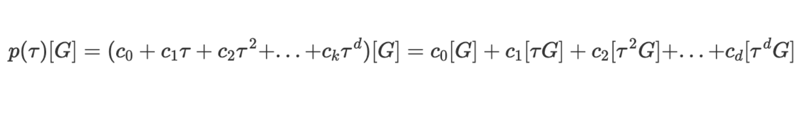

- Encrypted Exponentiation: with bilinear pairing, we can do (partially) homomorphic encryption for multiplication. But we can't do it with exponents
- The output of our previous pairing was an EC point in G12 which have 12 dimensions. If we construct a pairing with that point again, 
the output would be a group with massive dimension.
- Let's say we want to prove we know x such that: x^3 - 4x^2 + 3x - 1 = 0
- We can't give x to the verifier, so we encrypt it with G1, x' = xG1. The problem is the verifier can't compute
x^3 due to pairing can't be used twice, so our solution is to calculate all encrypted x, x^2, x^3 and give it to the verifier
- Trusted setup: typically, we use the above construction in reverse. Mainly because this algorithm requires the verifier
to do work linearly proportional to the size of the polynomial. We want succinct proof not a linear one
  - So we need a trusted party to generate a secret value t and encrypt it as: t[G], t^2[G], t^3[G]...t^d[G] where
  d is the degree of the polynomial
  - The prover will plug those encrypted t to their polynomial with coefficients c_i:
  - [result] = c_0[G] + c_1[tG] + c_2[t^2G] + ... + c_d[t^dG] (square brackets mean result is an EC point)
  - This would lead to: 
    - prover and verifier won't know the input of the polynomial (t and result are encrypted)
    - prover doesn't know what point they are evaluating, so they can't forge a fake proof
    - input and output are encrypted so the verifier can't learn about the polynomial 
- Conclusion: we can evaluate polynomial using EC points and get a valid output, without knowing the point we evaluated the polynomial at

- Polynomial over FF: we can only evaluate polynomials modulo the order of the EC group. This is because
EC forms a cyclic group, they have a "maximum" value they can encode. Polynomials over integers are not
- Schwarts Zippel Lemma: two unequal poly almost never overlap except at a number points constrained by the degree
  - In big prime finite field, the degree is vanishingly small compared to the order of the field. 
  - If we evaluate 2 polys at a random point x and p1(x) = p2(x) then we can almost certain they are the same even
  if we don't know the polys
- Prove we have four polys A(x), B(x), C(x), D(x) such as AB = CD
  - Give the encrypted evaluation of all four polys(A', B', C', D') to verifier and then verifier do the check A'B' = C'D'
  - Verifier can require the prover to use a known poly D. It puts known constraints on what polys the prover can use for A, B ,C
  - Verifier know that roots of poly D must be a subset of the roots of AB