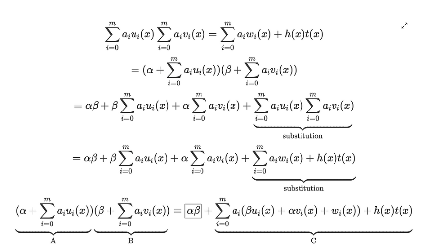
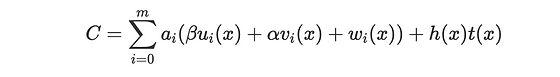

- Enable a QAP to be computed by a prover over EC points derived in a trusted setup, and quickly checked by a verifier.
- Motivation: the prover can simply invent a, b, c where ab = c and present those as EC points to the verifier
- We need to force the prover to be honest without too much computation overhead
- Secret shifting: Prover know [A]_1, [B]_2 and [C]_1, but we can force the prover to shift the values [A], [B] by an
    unknown amount.
  - This can be achieved by adding EC points [a'A] and [b'B] (a' = alpha, b' = beta)
  - They are created by a trusted setup, sampling randomly.
  - [A]_1 = [A_old]_1 + [a']_1
  - [B]_1 = [B_old]_1 + [b']_1
  - The prover can't predict the result of pairing [A] and [B], because it's a discrete logarithm problem
    - We can still create a balanced equation from the original QAP despite shifting A and B
    
  - Out verification formula becomes:
  
- Attack 1: forging A, B and deriving C
  - The prover selects a', b' randomly and creates [A]_1 = a'G1, [B]_2 = b'G2. It then tries to derive a value [C'] that
  is compatible with the verifier's formula. let's say he creates pairing(A1, B2) = [D]_12
  - If D is valid then: [D]_12 - [alpha_1, beta_2]_12 = [C]_12. However, the verifier need a G1 point ([C]_1), 
  - The prover then must take the discrete log of [C]_12 to get c and compute C' = [cG1]_1
- Attack 2: forging C and deriving A, B
  - The prover pick a random point c' and compute [C]_1 = c'G. They can also discover a combination of a' and b' such that
  a'b' = c'
  - They can compute: [D]_12 = pairing(alpha, beta) + pairing(C, G2)
  - Now they need to split D into A and B, however, they don't know the preimage of D, so they can't
- Attack 3: Forging [A'], [B'] with [a'G1] and [b'G2] and computing [C']
  - The problem with this approach is: after having A', B', they can only get D' = pairing(A', B)
  - To get C', they can only: pairing(A', B') - pairing(alpha, beta) = C'. 
  - And C' is a G12 point, they can't calculate C' because it's discrete log problem
- After shifting A, B by alpha and beta, C becomes this:

  - Beta will be an EC point after the trusted setup, it' can't be multiplied with the polynomial, so we
  have to precompute beta*u(t) + alpha*v(t) + w(t). This can be done by the trusted third-pary
  - 
- Trusted setup:
  - randomly choose (alpha, beta, tau) from out finite field
  - Compute powers of tau for A {[G1], [tG1], [t^2G1], ...[t^(n-1)G1]}
  - random shift for A: alpha' = [alphaG1]
  - powers of tau for B: {[G2], [tG2], [t^2G2], ...[t^(n-1)G2]}
  - random shift for B: beta' = [betaG2]
  - power of tau for C: {(beta*u0(t^0) + alpha*v0(t^0) + w0(t^0))[G1]..., (beta*ui(t^i) + alpha*vi(t^i) + wi(t^i))[G1]} where i = n-1
  - Power of tau for h(t)T(t): {t^iT(t)[G1], i = 0 -> n-2
- Prover steps:
  - Compute [A1] = alpha' + sum(a_i[u_i(t)]_1), i = 0->m
  - Compute [B2] = beta' + sum(b_i[v_i(t)]_2), i = 0->m
  - Calculate h(x) = (sum(a_i*u_i(x))*sum(a_i*v_i(x)) - sum(a_i*w_i)) / t(x)
  - [h(t)T(t] = sum(h_i[t^iT(t)G1])), i = 0 -> degree(h)
  - [C1] = sum(a_i*(beta*u(t) + alpha*v(t) + w(t)) + [h(t)T(t)])
  - proof = {A1, B2, C1}
- Verifier step: pairing(A1, B2) = pairing(C1, G2)