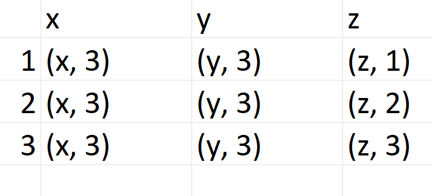
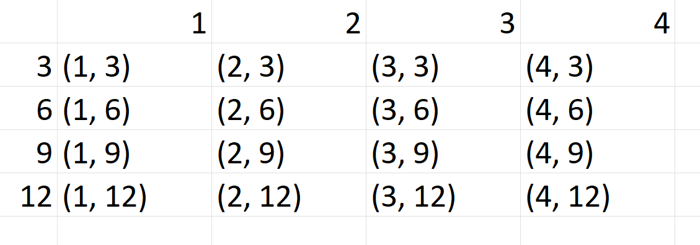
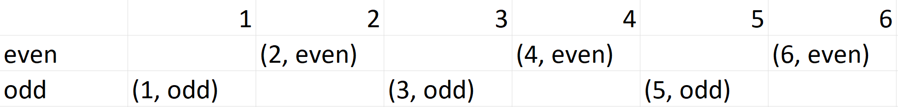
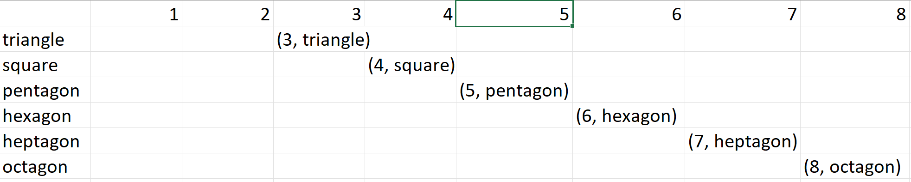

- A set is a well-defined collection of objects and each object is unique
- Sets are allowed to be empty
- Exercise 1: Set of rational numbers: {a/b: a, b in Z and b # 0)
- Exercise 2: Integers are subset of rational numbers, rational numbers are subset of real numbers, real numbers are subset of complex numbers
- Exercise 3: Transcendental numbers are subset of complex numbers
- Sets are considered equal if they contain the same elements, regardless of order
- Cardinality: sets can have finite or unfinite number of elements. There are different levels of infinite in set theory.
For example, there are infinitely many more real numbers than there are integers. We say integers are countably infinite and
real numbers are uncountably infinitive
- Exercise 4: If two finite sets have different cardinality, they cannot be equal: if C(A) != C(B) then there are three possible
cases will happen: A is subset of B or B is subset of A or A and B is not related (none of them is subset of the other)
For case 1: A is subset of B and C(A) != C(B) => C(A) < C(B) => they are not equal. Same reasoning goes for case 2.
For case 3: It's obvious that they are not equal
- Ordered pair: set do not respect order, but we can create an ordered pair by write a tuple pair (a, b) in set form {a, {b}}
This make (a, b) != (b, a) because {a, {b}} != {b, {a}}
- Cartesian product: denoted as AxB, is the set of all ordered pair of elements in A and elements in B.
AxB = { (a, b) : a in A & b in B }
- Cartesian product is not commutative: AxB != BxA
- Exercise 5: Compute the cartesian product of BxA (A = {1, 2, 3), B = {x, y, z} 
- Exercise 6: Compute the cartesian product of {1,2,3,4} and {3,6,9,12} (in that order).
If you were to pick 4 particular ordered pairs from this, what arithmetic computation would that encode

I would pick (1,3), (2, 6), (3, 9), (4, 12), it encodes y = x*3
- Subsets of the Cartesian product form a function
- In set-theoretic terms, a function is a subset of the Cartesian product of the domain and codomain sets
- For example, with the Cartesian product of AxB before, we can pick any subset like: {(1, y), (2, x), (3, z)}
- Mathematicians rarely concern with computability (but we as programmer do). A function is just a mapping between sets
How that function is computed, it not a concert of mathematicians
- Exercise 7: Define a mapping (function) from integers n ∈ 1,2,3,4,5,6 to the set {even, odd}

- Excercise 8: 
- Excercise 9: f = {(a, b): a in N and b in Z+}. It's possible to create a mapping between integers and rational numbers.
We just need to take the Cartesian product of integer numbers with itself, the result would be a series of tuples like this:
  (1, 1), (1, 2)..., (2, 1), (2, 2)... This is the basic form of all rational numbers. (note, b != 0)
- When defining a function with a Cartesian product, the same domain element can't map to two different co-domain elements