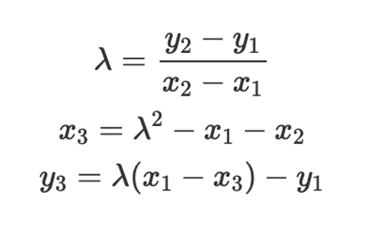

- Elliptic curves (EC) are a family of curves which have the formula: y^2 = x^3 + ax + b
- We can also view EC as an infinite set of points. Points are in the set iff they satisfy the elliptic curve equation
- EC forms an abelian group under addition
  - Identity element: the point at infinity (the point that is nowhere)
  - By the definition, the point at infinity must satisfy the elliptic curve equation but we can define sets however we like!
  - We definite the set that makes up the elliptic curve and the infinity point
    - Addition is closed: as long as we do not pick a perfectly vertical line, if we intersect two points in an EC, then we
    will also intersect a 3rd point on the EC
    - The inverse of an elliptic curve point is the negative of the y value of the pair: inverse of (x, y) is (x, -y)
    - Abelian group: when we pick two points, there is only one third point, it's clear that A+B = B+A
    - Elliptic curve addition flips over the X axis, this is to prevent the bug happend when the intersection is in the middle
- Formula for addition 
- Point multiplication: adding a point with itself, the process is similar to adding two arbitrary points. The only subtle
  difference is that A and B are the same, but they'll still intersect the curve at a third point. That's point on the
  tangent line with the first two points and the curve. The last step is to flip that point over the X axis
- We can efficiently multiply an elliptic curve point by a large integer quantity (not apply to prime number)
- If we try to do EC operations on real numbers then they would be very numerically unstable because the intersection
  could take a lot of decimals to compute
- In reality, we do everything modulo a prime number and we're still keeping the propertiers of EC