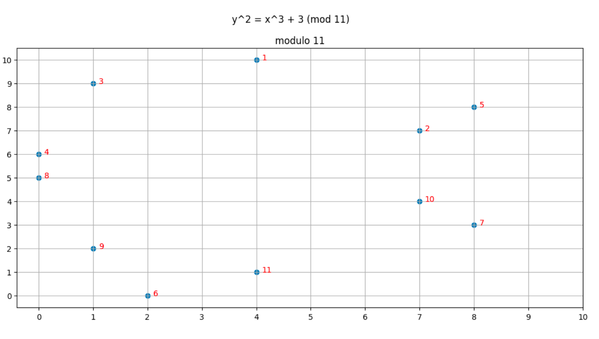

- When we define EC over finite field, it remains a group, but it becomes a cyclic group
- We can represent every number in a finite fields as an elliptic curve point and add them together just like we do in regular integer field
  - (5 + 7)mod p is homomorphic to 5G + 7G
- Generate EC y^2 = x^3 + 3 (mod 11). To solve the equation and determine which (x, y) points are on the curve, we'll need
  to compute sqrt(x^3 + 3)
- We use the Tonelli Shanks Algorithm to compute modular square roots
- Elliptic curve point addition: Our connect dot and flip approach still works with EC over finite field. Although we
  use square root to determine if a point is on the curve, and square root is not a valid EC operator, we do not
  use it for addition and doubling of points
- Every EC point in a cyclic group has a "number": we can assign each point a number based on how many times we added the
  generator to itself to arrive at that point
- 
- Points that share the same x coordinate add up to 12 which coresspond to the identity element (12 mod 11 = 1)
- Order is not the modulus: in our example, order = 12 while modulus = 11
- Multiplication is really just repeated addition (actually we can with bilinear mapping, but it's another topic)
- If you start with a point r and add the curve order o, you get r back
- The implication of the above statement is that: (x+y)mod o = xG + yG
- Basic Zero knowledge proofs with EC:
  - Claim: I know two values such that: x + y = 15
  - Proof: multiply x by G1 and y by G1 and give those to you as A and B
  - Verifier: Multiply G1 by 15 and verify A + B == 15G1
  - Verifier doesn't know about x and y, but it still can verify x+y == 15
- Excerise: prove knowledge of a solution to a system of linear equations
- let's say our linear system of equations has the form of Ax + By = C. We assume both verifier and prover know
  the coefficients A, B, C.
  - Claim: we know x, y such that Ax + By = C
  - Proof: multiply x by A and y by B and give those to verifier as A' and B'
  - Verifier: Multiply G1 by A' and B' and verify G1(A' + B') = G1C
- Security assumptions: we are assuming that a point created by multiply(G1, x) can't be brute force by an attacker
  to find the original value x from a point (x, y)